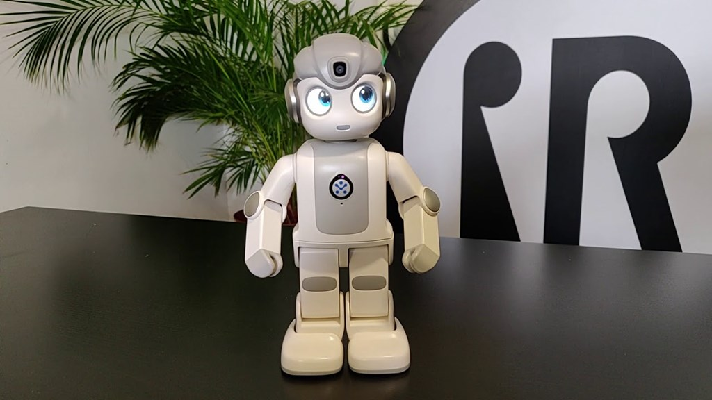
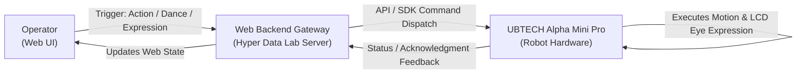

# UBTECH Alpha Mini Pro — Web Control & Action Maintenance

  
  
<em>Maintenance & Optimization of the Web Control System for the UBTECH Alpha Mini Pro Humanoid Robot</em>

  
<strong>OJT Internship Project | Hyper Data Lab — FPT University HCMC</strong>

---

> **IP & Copyright Notice:**  
> This project is the intellectual property of **Hyper Data Lab — FPT University HCMC**.  
> This personal repository serves as a technical log, architectural overview, and record of tasks completed during the On-the-Job Training (OJT) internship. Internal source code remains confidential in compliance with lab policies.

---

## 1. Project Overview
During my OJT internship at **Hyper Data Lab — FPT University HCMC**, I participated in taking over, maintaining, and stabilizing the Web Control Platform for the **UBTECH Alpha Mini Pro** humanoid robot.  
The platform enables users to interact with and control behavioral sequences, facial expressions, and physical movements of the robot through an intuitive web interface.

---

## 2. Maintenance Scope & Key Responsibilities
My primary focus was on maintaining, reviewing, and stabilizing the end-to-end command execution pipeline from the Web UI to the physical robot across the following key functional modules:

### 1. On-Click Action Triggers
- Maintained and tested the command dispatch flow when users interact with action buttons on the Web interface.
- Ensured the robot accurately responded to discrete posture and motion routines (e.g., greeting, standing up, sitting down, arm/head gestures, twisting).
- Troubleshot command latency issues and resolved instances where action execution signals were dropped.

### 2. Dance & Music Synchronization
- Reviewed and maintained execution routines for choreographed dance sequences synchronized with predefined music tracks.
- Ensured smooth coordination across all 14 servo joints, maintaining physical balance and accurate timing alignment with audio playback.

### 3. LCD Facial Expression Control
- Maintained event triggers for rendering expressive animations on the robot's dual LCD eye displays via Web selections (e.g., happy, blinking, surprised, focused).
- Fixed desynchronization issues and bugs where the eye display failed to update in alignment with active physical motions.

---

## 3. High-Level Architecture

---

## 4. Key Takeaways & Skills Acquired
- **Hands-on Robotics Experience:** Gained comprehensive understanding of inheriting, maintaining, and testing hardware-controlling software (Robotics Web Interface) within a research lab environment at FPT University HCMC.
- **Troubleshooting & Debugging:** Enhanced data flow diagnostics across the full stack: `Frontend (UI) ↔ Backend Gateway ↔ Robot Hardware SDK/APIs`.
- **Professional Engineering Standards:** Practiced strict adherence to lab intellectual property policies, confidentiality standards, and engineering responsibility in real-world projects.

---

  Hyper Data Lab — FPT University HCMC | OJT Maintenance Log

